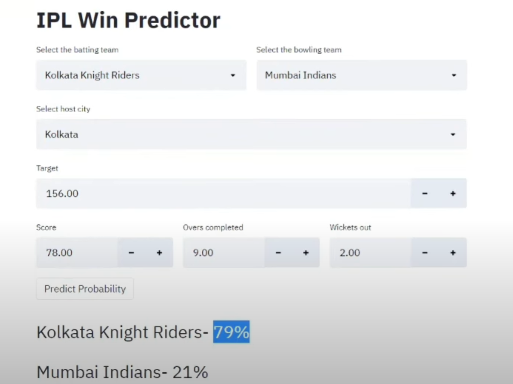

# -IPL-Win-Probability-Predictor


A **Streamlit web app** that predicts the winning probability of an IPL match using machine learning. Just input the match details like teams, venue, score, overs, and wickets — and get a live prediction!



---

## 🚀 Features

- Predicts win probability based on match progress
- Real-time prediction updates
- Simple, intuitive web interface using Streamlit
- Trained using historical IPL data and Logistic Regression,svm

---

## 📦 Tech Stack

- Python 3.7.10
- Pandas
- Scikit-learn
- Streamlit

---

## ⚙️ Setup Instructions

### 1. Clone the repository

```bash
git clone https://github.com/your-username/ipl-win-predictor.git
cd ipl-win-predictor
````

### 2. Create and activate a conda environment

```bash
conda create -n ipl_app python=3.7.10
conda activate ipl_app
```

### 3. Install dependencies

```bash
pip install -r requirements.txt
```

Or manually:

```bash
pip install streamlit pandas scikit-learn
```

### 4. Run the app

```bash
streamlit run app.py
```

---

## 📁 File Structure

```
.
├── app.py                # Main Streamlit app
├── pipe.pkl              # Trained machine learning model
├── requirements.txt      # Python dependencies
├── README.md             # This file
└── screenshots/
    └── ipl_win_predictor_demo.png
```


## 📬 Contact

**Abhay Thakre**
[GitHub](https://github.com/abhay34-ai) | [LinkedIn](https://www.linkedin.com/in/abhay-thakre-a402b1370/)

